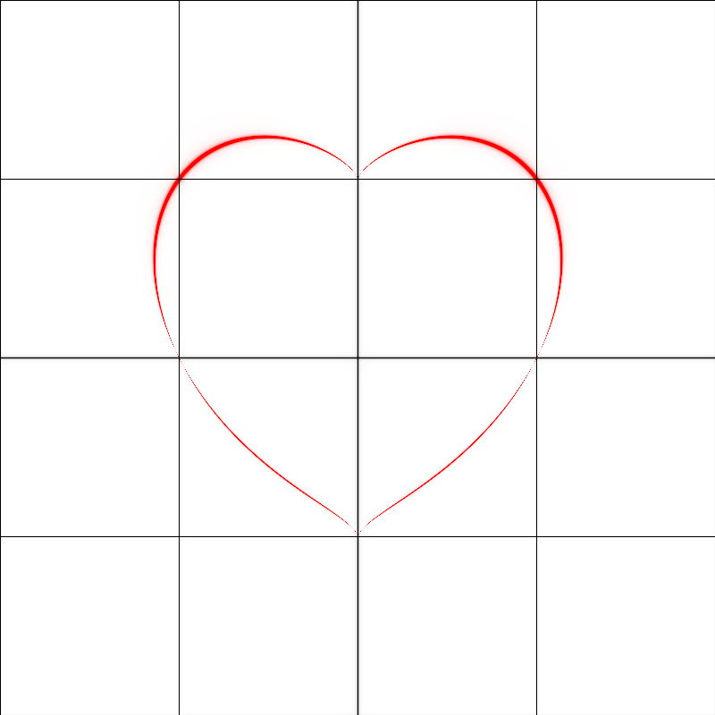
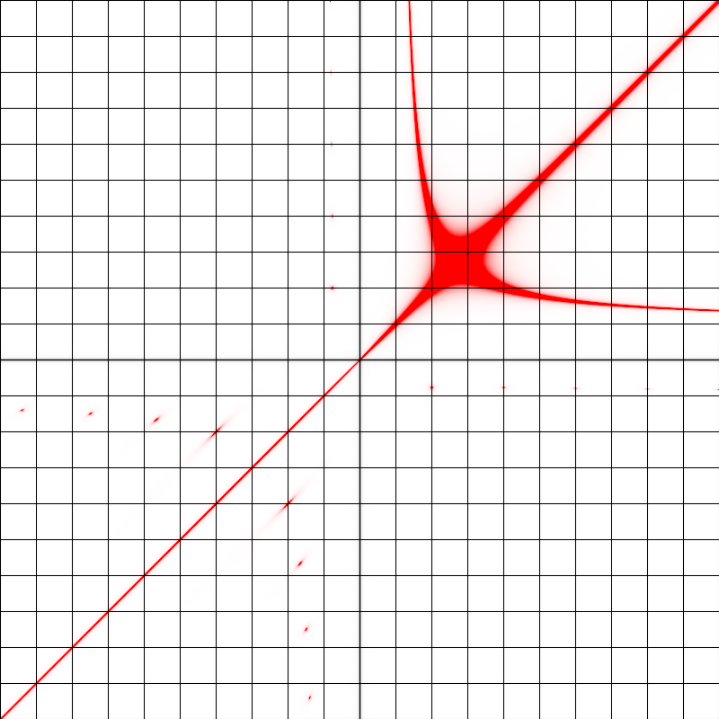
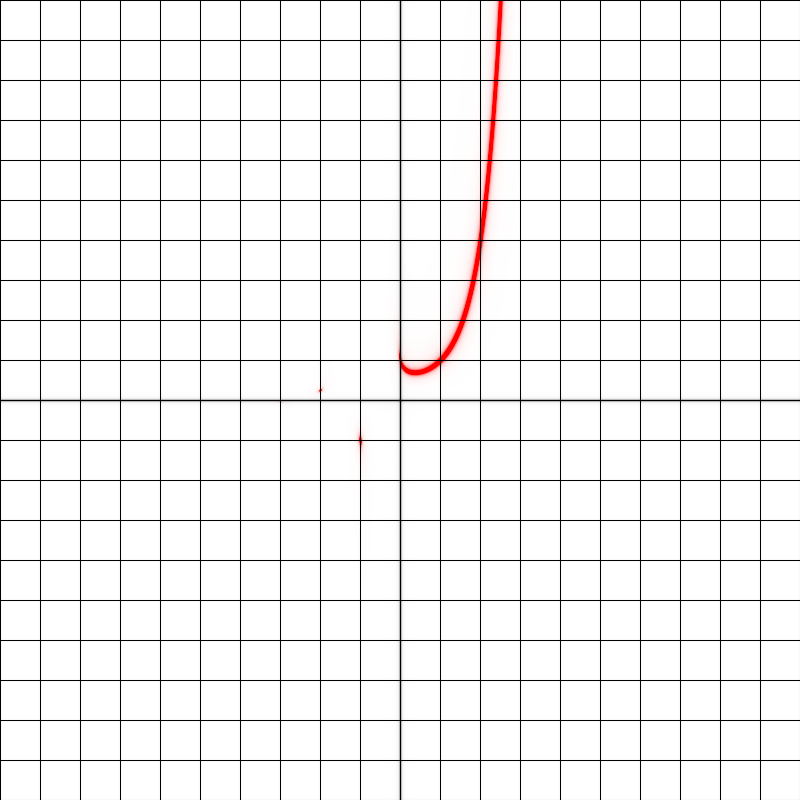

# fuzzyplot

### A fuzzier graph plotting method

`(x^2 + y^2 - 1)^3 = x^2*y^3`

With or without axes

`x^y = y^x`

Uses complex intermediate values, which can reveal hidden point-solutions, as in the above example, and the one below

`y = x^x`
