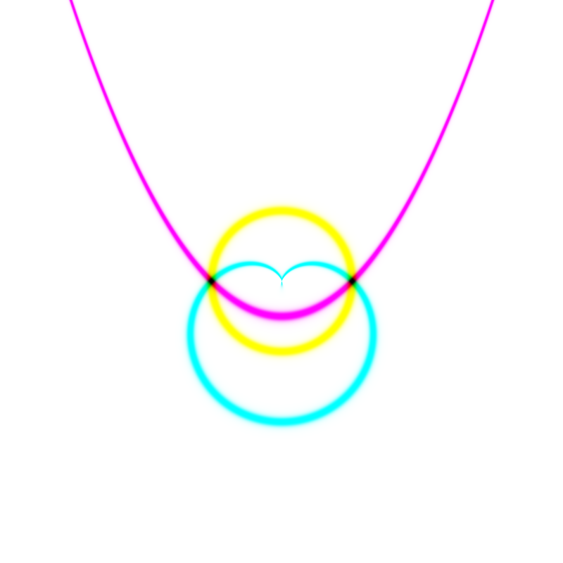
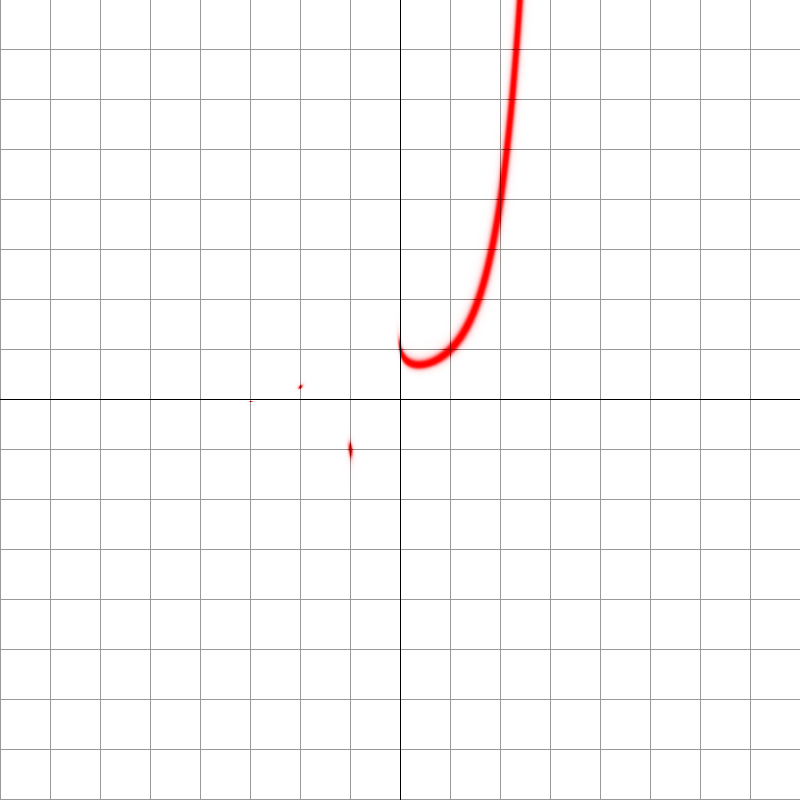

# fuzzyplot :heart:

### A fuzzier graph plotting method

`fuzzyplot "r=1-sin(t)" "r=1/(1-sin(t))" "r=1" -Ap -z -2`

#### How does it work ?

`fuzzyplot` graphs equations of the form . Instead of finding the points where the two sides of the equation are equal (as in traditional plotting methods), `fuzzyplot` shows the points where the two sides of the equation are *very close* to being equal. This is done with a sort of fuzzy effect, where the smaller the difference between the two sides is, the more intense the color at that point will be. Hence the name.

#### What benefits does this give ?

- Shows point-solutions that may be hard to find with other methods
- Makes the graphs look soft and pretty \^\_\^

### Pictures !

Axes can be turned off with the `-A`/`--axisless` flag

`fuzzyplot "(x^2 + y^2 - 1)^3 = x^2 y^3 --axisless"`

The `-z`/`--zoom` option lets you set the zoom level. Negative numbers mean zoom out.

`fuzzyplot "x^y = y^x" --zoom -3`

`fuzzyplot` uses complex intermediate values, which can reveal hidden point-solutions, as in the above example, and the one below

`fuzzyplot "y = x^x" --zoom -3`

By default, `fuzzyplot` divides the difference in the equation by the magnitude of the two expressions, in order to counteract the bias toward small values. Sometimes certain graphs work better with just plain difference, without the division. This mode can be set with the `-p`/`--plain` flag.

`fuzzyplot "r = 3/2 (1 - sin(t))" --zoom -2 --plain`

`fuzzyplot` supports up to 3 equations per image, passed as arguments one after the other. When only 1 equation is given, it is colored red, but if 2 or 3 are given, they are colored cyan, magenta, yellow, in that order. The colors mix together like colored filters.

`fuzzyplot "±r=sin(t)" "±r=sin(t+2pi/3)" "±r=sin(t+4pi/3)" -A`

